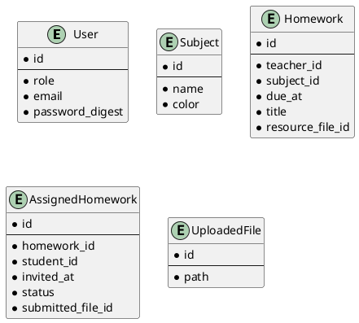

# README


## Prerequisites
- Ruby 3+
- Postgresql 15+

## Development Setup in local

1. `git clone` this repo
2. Make sure postgres is running

```sh
# setup project
bin/setup

# prepare database
# bundle exec rails db:create db:migrate db:seeds 
bundle exec rails db:prepare

# run dev server
bundle exec rails server

# run test
bundle exec rspec
```

## Development Setup with docker

```sh
docker-compose up

# running rails console for debugging
docker exec -it homework-be_dev bash
```


## Deployment (docker)


## ERD


<details>
<summary>PUML</summary>



</details>


## API docs

```sh
# get oauth token
POST /oauth/token

```

```js
{
  'email':'email@example.com',
  'password':'PASSWORD',
  'grant_type': 'password'
}
```

#### homeworks

```
GET /api/v1/teachers/homeworks
```

```json
body: {
  "homeworks": [
    {
      "title":"Calculus",
      "subject":"Mathematics",
      "due_date":"25-10-2024",
      "submitted": 3,
      "total": 20
    }
  ],
  "meta": {
    "current_page": 1,
    "next_page": 1,
    "prev_page": null,
    "total_pages": 1,
    "total_count": 6
  }
}
```

<!-- This README would normally document whatever steps are necessary to get the
application up and running.

Things you may want to cover:

* Ruby version

* System dependencies

* Configuration

* Database creation

* Database initialization

* How to run the test suite

* Services (job queues, cache servers, search engines, etc.)

* Deployment instructions

* ... -->
